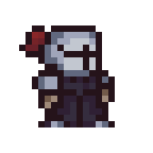

	
	 
	<h1 style="font-size:30px">CROGUE</h1>
	
	 
	
	
	

#### CRogue

*CRogue* es un proyecto de fin de curso para la materia Programación Orientada a Objetos que partió desde la idea de presentar algo diferente a los demás. Sí, egoísmo puro. Con un tiempo de desarrollo de un mes, se intentó realizar un roguelike, lo cual fue imposible debido a varios motivos.

#### Descarga

El juego puede descargarse desde el siguiente [link](https://github.com/falseme/CRogue/releases/tag/v-0.1-alpha) o accediendo al [historial de versiones](https://github.com/falseme/CRogue/releases).
Se descarga un `.rar` con el ejecutable y la carpeta `data` los cuales deben permanecer juntos para su correcto funcionamiento.

#### Licencias

Los assets los robé de un montón de lugares diferentes y me olvidé los nombres, pero principalmente utilicé los de [Pixel Poem](https://pixel-poem.itch.io/dungeon-assetpuck).